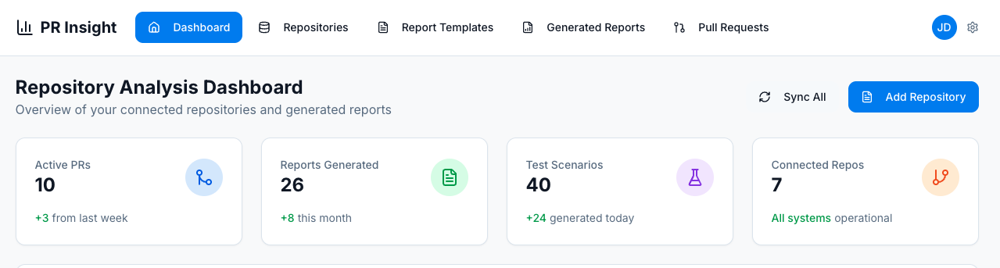

# PR Insight - AI-Powered Pull Request Analysis Platform


## Overview

PR Insight is a comprehensive GitHub repository analysis platform that automates the generation of detailed, AI-powered PDF reports tailored for different stakeholders. The system integrates seamlessly with GitHub repositories to sync pull requests and uses advanced AI (Google Gemini) to generate customized reports for project managers, QA teams, and clients.

## 🚀 Features

### Core Functionality
- **GitHub Integration**: Connect repositories using GitHub tokens with automatic PR synchronization
- **Multi-Audience Reports**: Generate tailored reports for different stakeholders:
  - **Project Managers**: High-level summaries with timeline and risk assessments
  - **QA Teams**: Detailed technical analysis with testing scenarios and risk indicators
  - **Clients**: Executive summaries focusing on business impact and progress

### Advanced Report Management
- **Template System**: Create and reuse customizable report templates
- **Multiple Report Generation**: Generate multiple reports of the same type with chronological tracking
- **Action Buttons**: Quick generation of complementary report types from existing reports
- **PDF Export**: Professional PDF reports with consistent formatting
- **Preview & Download**: Web preview before PDF generation

### Repository Analysis
- **MVP Progress Reports**: Repository-level summaries for client presentations
- **Risk Assessment**: Color-coded PR risk indicators with detailed analysis
- **Insight Generation**: Automated analysis categorized by type and severity
- **Statistics Dashboard**: Real-time metrics on PRs, reports, and repository activity

### User Experience
- **Modern UI**: React + Tailwind CSS with shadcn/ui components
- **Real-time Updates**: Live synchronization with GitHub repositories
- **Smart Validation**: Form validation with helpful error messages
- **Responsive Design**: Optimized for desktop and mobile devices

## 🏗️ Tech Stack

### Frontend
- **React 18** with TypeScript
- **Vite** for fast development and building
- **Tailwind CSS** for styling
- **shadcn/ui** component library
- **TanStack Query** for server state management
- **Wouter** for lightweight routing
- **React Hook Form** with Zod validation

### Backend
- **Node.js** with Express.js
- **TypeScript** with ES modules
- **Drizzle ORM** for type-safe database operations
- **PostgreSQL** with Neon serverless hosting
- **Puppeteer** for PDF generation

### AI & Integrations
- **Google Gemini AI** for content generation
- **GitHub API** for repository and PR data
- **Neon Database** for data persistence

## 📸 Application Screenshots

### Dashboard Overview
*Main dashboard showing repository management and report generation options*




### Reports Management  
*Generated reports with action buttons for creating additional report types*


### Pull Request Risk Assessment
*Color-coded PR analysis with risk indicators and detailed insights*


*Note: Mockup interface design - actual application interface may vary*

### PDF Report Preview
*Professional AI-generated reports with comprehensive analysis*


*Note: Mockup interface design - actual application interface may vary*

> **Note**: The screenshots above are design mockups to illustrate the application's functionality. For actual screenshots of the running application, please run the application locally and capture your own screenshots.

## 🛠️ Installation & Setup

### Prerequisites
- Node.js 18+ 
- PostgreSQL database (or Neon account)
- GitHub Personal Access Token
- Google Gemini API Key
- Chrome/Chromium browser (for PDF generation)

### Environment Variables
Create a `.env` file in the root directory:

```env
# Database (Required)
DATABASE_URL=your_postgresql_connection_string

# APIs (Required)
GITHUB_TOKEN=your_github_personal_access_token
GEMINI_API_KEY=your_google_gemini_api_key

# Security
SESSION_SECRET=your_session_secret

# Optional: Individual database connection parameters
# (Only needed if not using DATABASE_URL)
PGHOST=your_host
PGPORT=5432
PGUSER=your_username
PGPASSWORD=your_password
PGDATABASE=your_database
```

### Puppeteer/PDF Generation Setup

This application uses Puppeteer to generate PDF reports. The configuration is optimized for Replit environments but may need adjustment for local development:

**For Replit**: No additional setup required - Chromium path is preconfigured.

**For Local Development**: 
- Install Chrome/Chromium on your system
- The app will attempt to use the system's Chrome installation
- If you encounter PDF generation issues, you may need to:
  1. Install Puppeteer Chromium: `npx puppeteer install`
  2. Or set a custom executable path in `server/services/pdf.ts`

### Installation Steps

1. **Clone the repository**
   ```bash
   git clone <repository-url>
   cd pr-insight
   ```

2. **Install dependencies**
   ```bash
   npm install
   ```

3. **Set up the database**
   ```bash
   npm run db:push
   ```

4. **Start the development server**
   ```bash
   npm run dev
   ```

5. **Access the application**
   Open your browser and navigate to `http://localhost:5000` (port may vary - check console logs)

## 📖 Usage Guide

### Getting Started

1. **Add a Repository**
   - Click "Add Repository" on the dashboard
   - Enter your GitHub repository URL
   - Provide a GitHub token with repository access
   - The system will validate and sync the repository

2. **Generate Repository Reports**
   - Select a repository from the dropdown
   - Choose report type (MVP Summary or Client Overview)
   - Optionally select a custom template
   - Click "Generate Report" to create AI-powered analysis

3. **Generate PR Reports**
   - Select a specific pull request
   - Choose your audience type (PM, QA, or Client)
   - Pick an optional template for customization
   - Generate targeted reports for different stakeholders

4. **Manage Reports**
   - View all generated reports in the Reports section
   - Preview reports in your browser before downloading
   - Download professional PDF versions
   - Generate additional report types using action buttons

### Advanced Features

- **Template Management**: Create reusable report templates for consistent formatting
- **Risk Assessment**: View color-coded PR risk indicators and detailed analysis
- **Insights**: Access automated repository insights categorized by severity
- **Multiple Reports**: Generate multiple versions of the same report type with tracking

## 🔒 Security & Privacy

- **Token Security**: GitHub tokens are stored in the database and excluded from public API responses
- **Environment Isolation**: Development and production databases are separate
- **API Rate Limiting**: Proper handling of GitHub API rate limits
- **Data Protection**: All sensitive data is handled according to best practices

> **Note**: Ensure GitHub tokens have minimal required scopes (repository read access) for security.

## 🤝 Contributing

1. Fork the repository
2. Create a feature branch (`git checkout -b feature/amazing-feature`)
3. Commit your changes (`git commit -m 'Add some amazing feature'`)
4. Push to the branch (`git push origin feature/amazing-feature`)
5. Open a Pull Request

## 📄 License

This project is licensed under the MIT License - see the LICENSE file for details.

## 🙏 Acknowledgments

- **Google Gemini AI** for intelligent content generation
- **GitHub API** for repository data access
- **Neon** for serverless PostgreSQL hosting
- **shadcn/ui** for beautiful UI components
- **Vercel** for deployment infrastructure

## 🐛 Bug Reports & Feature Requests

Please use the GitHub Issues tab to report bugs or request new features. Include as much detail as possible to help us understand and address your concerns quickly.

---

**Built with ❤️ using modern web technologies and AI-powered analysis**